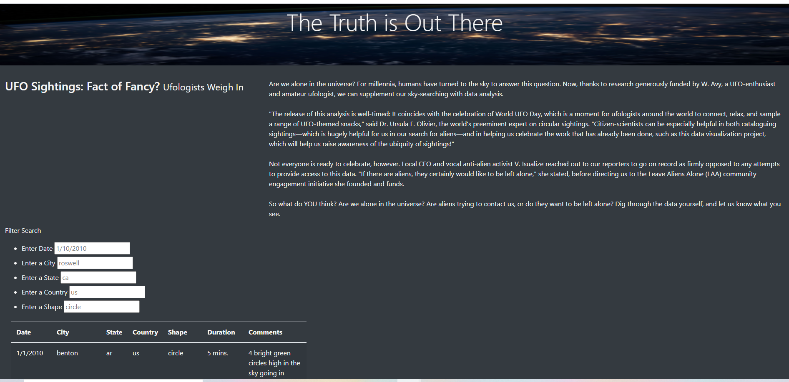
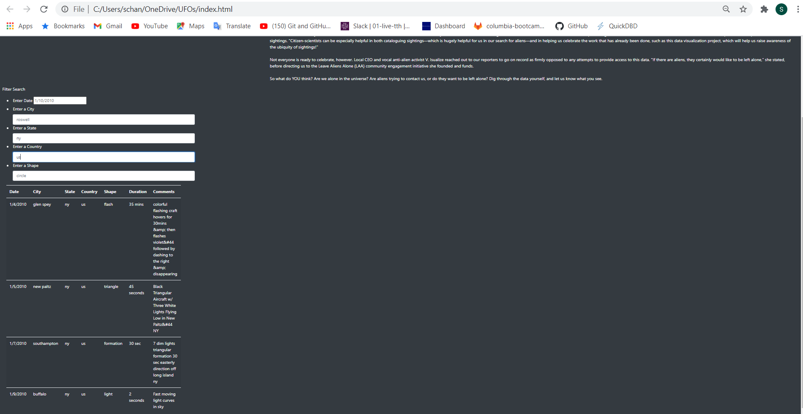

# UFOs

# Overview of Project
The purpose of this analysis is to present data related to UFO sightings in an interactive and user-friendly manner. This was done by adding the ability to filter a table based on multiple search criteria. 

# Results 

The user will have the freedom to specifically look up an item in Dana's UFO table data by using the provided filters. The user can input the desired date, city, state, country, and even shape of the UFO sighting in the search boxes followed by pressing "Enter" to return the results of the search.

The image below shows the search fields ready to accept criteria to perform a search: 

The second image below shows the search results for UFO sightings in New York when a search for "ny" is performed:

# Summary: In a summary statement, describe one drawback of this new design and two recommendations for further development.

One drawback of this new design is that the search fields are case sensitive and character-sensitive. For example: if a user searches for UFO data by state by typing "NY", no results will be returned. However, if the user searches for lowercase "ny", four results will be returned.

Two recommendations for further development include: 

- Adding code to return results similar to the search if the exact search results do not exist in the table's data. A search that shows related results might help the user if the exact search does not return a result. 

- The user may not know exactly what to look for in the data table so having an autocomplete capability added to the search field as each value is inputted may assist the user in searching for specific information.
